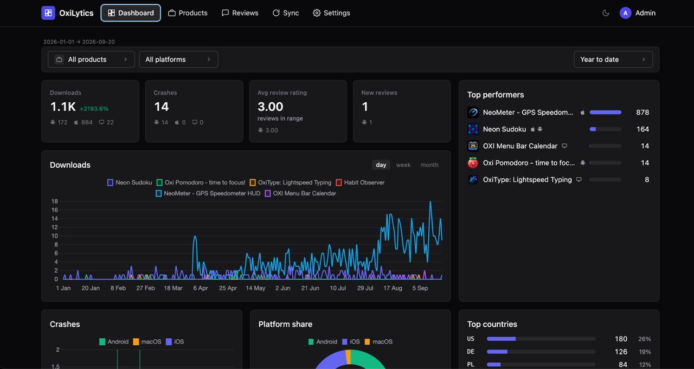

<div align="center">

<h1>OxiLytics</h1>

**Self-hosted, privacy-first app analytics for App Store Connect and Google Play.**

Your download, crash, rating and review data from Apple and Google — pulled into
*your own server*, stored in *your own* SQLite file, shared with nobody.

[](LICENSE) [](https://go.dev) [](https://svelte.dev) [](https://github.com/oxisoft/oxilytics/pkgs/container/oxilytics) [](#deployment)

Built and open-sourced by **[OxiSoft](https://oxisoft.io)** — a privacy-first
software studio. Free for everyone, forever, under the MIT licence.

[Website](https://oxisoft.io) · [Our apps](https://oxisoft.io/apps/) · [Blog](https://oxisoft.io/blog/) · [Why we don't track users](https://oxisoft.io/blog/why-we-dont-track-users/) · [Contact](https://oxisoft.io/contact/)

</div>



---

## What is OxiLytics?

**OxiLytics is a self-hosted alternative to third-party mobile analytics
platforms** such as Firebase Analytics, AppsFlyer, Adjust, Mixpanel, Amplitude
or App Annie / data.ai — for the part that matters to most indie developers and
small studios: **how your apps are actually performing on the stores.**

The difference is *where the data comes from* and *where it goes*.

| | Typical SaaS analytics | **OxiLytics** |
|---|---|---|
| **Data source** | An SDK compiled into your app | The official **store reporting APIs** |
| **SDK in your app** | Required | **None. Ever.** |
| **Who sees your numbers** | The vendor, and their sub-processors | **Only you** |
| **Where data lives** | Vendor cloud, foreign jurisdiction | **Your server, your disk** |
| **User tracking** | Per-user events, device IDs, IDFA | **No user-level data exists** |
| **GDPR / DSA exposure** | Data-processing agreements, transfers | Nothing leaves your machine |
| **Cost at scale** | Per-event / per-MAU pricing | Free. It is one binary. |
| **Lock-in** | Export if they let you | Plain SQLite you already own |

> **OxiLytics never touches your users.** It contains no SDK, no tracking pixel
> and no client library. It authenticates *as you* against Apple's and Google's
> own reporting endpoints and reads the **aggregated** statistics they already
> publish to you in the consoles. There is no per-user, per-device or per-session
> data in the system, because the stores never hand that out and we never ask.

### Privacy-first and on-premises by design

This is not a hosted service with a self-hosted tier. There is no OxiLytics
cloud, no account to create, no phone-home, no licence check, no usage
telemetry, and no "anonymous statistics" toggle hiding in the settings.

- **On-premises.** One Go binary, one SQLite file, one Docker image. Runs on a
  €4 VPS, a Synology NAS, a Raspberry Pi or a laptop.
- **Egress is store APIs only.** Outbound traffic goes to `apple.com` and
  `googleapis.com` (plus Apple's public iTunes lookup for app icons). Nothing
  else. Verify it with `tcpdump` — we'd encourage it.
- **Your data stays yours.** `oxilytics.db` is an ordinary SQLite database.
  Open it with any SQLite tool, back it up with `cp`, delete it and the product
  is gone without trace.
- **Aggregated only.** Country, platform, day. No identifiers, because we never
  receive any.

We built it because we needed it for [our own
apps](https://oxisoft.io/apps/), and we ship the apps the same way: no ads, no
trackers, no accounts. Read more on the [OxiSoft blog](https://oxisoft.io/blog/).

---

## Features

### Dashboard
Portfolio-wide **downloads, crashes, average rating and new reviews** for any
date range, with the split per platform under each number. A **downloads chart**
(day / week / month buckets) and a **Top performers** panel ranking your
products by downloads. Plus **platform share**, **crash trends** and **top
countries**.

### Products, not bundle IDs
You think in *"Neon Sudoku"*, not in `io.example.sudoku` on one store and
`6744125178` on another. OxiLytics links your store listings into a **product**,
so the iOS, macOS and Android builds of the same app roll up into **one row with
one number** — with the per-platform breakdown one click away. Unmatched
listings get automatic linking suggestions.

### Reviews
Every review from both stores in one inbox: full-text search, filter by rating,
platform, product, country or developer-reply status, and **CSV export**.
Metrics export to CSV too, so the numbers drop straight into a spreadsheet.

### Sync
**Full sync** walks the entire available history; **delta sync** fetches only
what changed. Run it manually or let the built-in scheduler do it daily. Every
run is logged with per-app progress, row counts and errors, so a failure is
visible instead of silent.

### Operations
Admin / viewer **roles**, optional **TOTP two-factor**, encrypted cookie
sessions, **read-only API tokens** for your own scripts, automatic database
backups, and light / dark themes.

---

## What each store actually reports

**This is the part every analytics tool glosses over, and it will mislead you if
you don't know it.** Apple and Google do not publish the same metrics, so a
single "portfolio total" can silently mean *one platform only*. OxiLytics shows
the per-platform split under every number rather than pretending the stores
agree.

| Metric | App Store (iOS / macOS) | Google Play (Android) |
|---|:---:|:---:|
| **Downloads** (first-time installs) | ✅ | ✅ |
| **Redownloads** | ✅ | — |
| **Updates** | ✅ | ❌ *not in Play's reports at all* |
| **Uninstalls / deletions** | ⚠️ weekly, volume-gated | ✅ daily |
| **Active devices** | — | ✅ |
| **Crashes** | ✅ | ✅ |
| **ANRs** (app not responding) | n/a | ✅ |
| **Ratings** | ✅ store-wide average | ✅ daily |
| **Written reviews** | ✅ | ✅ full history |
| **Per-country breakdown** | ✅ | ✅ |

**Consequences worth knowing before you compare numbers:**

- **Google Play's install reports contain no "updates" column.** Any
  cross-platform "updates" total is therefore iOS-only. We removed that KPI from
  the dashboard rather than show a number no store backs.
- **Apple's deletions report is weekly and volume-gated** — below a privacy
  threshold Apple publishes nothing. Expect far fewer Apple uninstalls than
  Android ones; that is Apple's reporting, not lost data.
- **Apple frequently has zero *written* reviews** while still showing a star
  rating: the rating comes from the public listing, the reviews API returns only
  actual text reviews.
- **App icons:** Apple's public lookup covers *published* apps only and is
  country-scoped, so an unreleased or region-limited app legitimately has no
  icon there. For those, OxiLytics falls back to the Play listing icon.

### Platform support

| Platform | Store | Status |
|---|---|---|
| **iOS / iPadOS** | App Store Connect | ✅ Full support |
| **macOS** | App Store Connect | ✅ Full support — separate platform, own glyph, own colour |
| **Android** | Google Play | ✅ Full support |
| **Windows** | Microsoft Store | 🔜 Planned |

> A single App Store Connect key covers **both iOS and macOS** — they arrive as
> distinct platforms and stay distinguishable everywhere in the UI.

---

## Quick start

```sh
mkdir oxilytics && cd oxilytics

curl -fsSLO https://raw.githubusercontent.com/oxisoft/oxilytics/main/deploy/docker-compose.yml
curl -fsSL  https://raw.githubusercontent.com/oxisoft/oxilytics/main/deploy/.env.example -o .env

openssl rand -hex 32          # → paste as OXI_SESSION_KEY in .env

mkdir -p data secrets
sudo chown -R 65532:65532 data   # container runs as distroless "nonroot"

docker compose up -d
```

Open **`http://127.0.0.1:8080`** and sign in with the bootstrap admin from
`.env`. Until a store is connected the app starts in **setup mode** and walks
you through it — including a **Test connection** button per store that tells you
exactly which check failed.

Then follow the store guides below. 👇

---

## Connecting App Store Connect

**You get:** apps, downloads, redownloads, updates, deletions, crashes, reviews
and the store-wide rating — per day and per territory, for **iOS and macOS**.

**You need:** an Apple Developer Program membership, and an App Store Connect
user with the **Admin** or **App Manager** role. Lesser roles cannot create the
key *or* request analytics reports.

### Steps

1. Open **App Store Connect → Users and Access → Integrations → App Store Connect API**
   ([direct link](https://appstoreconnect.apple.com/access/integrations/api)).
2. If you see **Request Access**, request it once for the team — the Account
   Holder has to accept before keys can be made.
3. Under **Team Keys**, click **Generate API Key** (the `+` button):
   - **Name:** `oxilytics`
   - **Access:** **App Manager** (Admin also works).
     ⚠️ *Sales and Reports* or *Developer* are **not** enough for Analytics Reports.
4. Download **`AuthKey_XXXXXXXXXX.p8`**. **Apple lets you download it once.**
5. Note the **Key ID** (10 characters, in the row) and the **Issuer ID** (the
   UUID at the top of the page).
6. Save the file as **`secrets/AuthKey.p8`** and set in `.env`:

   ```ini
   OXI_ASC_KEY_ID=ABC123DEFG
   OXI_ASC_ISSUER_ID=69a6de7e-xxxx-xxxx-xxxx-xxxxxxxxxxxx
   ```

   > The compose file already mounts `./secrets` read-only and points
   > `OXI_ASC_KEY_FILE` at `/secrets/AuthKey.p8`, so keep that filename and
   > there is no path to configure. Running without Docker? Set
   > `OXI_ASC_KEY_FILE` to wherever the `.p8` lives.

7. `docker compose up -d`, then press **Test connection**.

<details>
<summary><b>What "Test connection" verifies, and what the errors mean</b></summary>

It checks, in order: the key file is a valid **EC P-256** private key → the JWT
is accepted (`GET /v1/apps`) → the **analytics reports** permission works →
reviews are readable.

| Message | Cause and fix |
|---|---|
| `401 NOT_AUTHORIZED` | Key ID / Issuer ID mismatch, or the key was revoked. |
| `403 FORBIDDEN` on analytics | Key role too low — generate a new **App Manager** key. |
| `403 … API access not enabled` | Step 2 was never completed. |
| No apps returned | The key belongs to a different team. |

**The first full sync can take several hours.** Apple produces historical
analytics asynchronously: OxiLytics requests a `ONE_TIME_SNAPSHOT` report and
waits for Apple to generate it. That is normal, not a hang. Apple also retains
daily analytics for a limited window — run the first full sync soon after setup.
</details>

---

## Connecting Google Play

**You get:** installs, uninstalls, upgrades, active devices, crashes, ANRs and
ratings per day and country, plus the full review history — for **Android**.

**You need:** a Google Play Console **owner** (or an admin who can manage users)
and any Google Cloud project.

### Steps

1. **Create a service account**
   1. Open [Google Cloud → IAM → Service accounts](https://console.cloud.google.com/iam-admin/serviceaccounts)
      and pick or create a project.
   2. **Create service account** — name it `oxilytics`. **No project roles are needed.**
   3. Open it → **Keys → Add key → Create new key → JSON**. Save as
      `gplay-sa.json` and note the service-account e-mail
      (`oxilytics@<project>.iam.gserviceaccount.com`).
2. **Enable the API** — [Google Play Android Developer API](https://console.cloud.google.com/apis/library/androidpublisher.googleapis.com)
   → **Enable**, in the same project.
3. **Invite the service account in Play Console**
   1. [Play Console](https://play.google.com/console) → **Users and permissions → Invite new users**.
   2. E-mail: the service-account address from step 1.3.
   3. Account-level permissions: **View app information and download bulk
      reports (read-only)** and **View app quality information (read-only)**.
      Reply-to-reviews and financial permissions are **not** needed.
   4. Send the invite — a service account accepts automatically.
4. **Find your reports bucket**
   1. Play Console → **Download reports → Statistics** (any app).
   2. Click **Copy Cloud Storage URI** — e.g.
      `gs://pubsite_prod_8241096735521408897/stats/installs/`.
   3. Your bucket is the `pubsite_prod_…` part.

   > ⚠️ **The bucket name has no `rev_`.** Google's own help pages still
   > document `pubsite_prod_rev_…`, and very old accounts do use that form — but
   > the URI the Console copies today is `pubsite_prod_<developer-id>`. **Copy
   > the real URI instead of composing one from the docs.** A wrong bucket fails
   > with `403`, which reads like a permissions problem and will send you
   > debugging entirely the wrong thing.

5. Save the JSON as **`secrets/gplay-sa.json`** and set in `.env`:

   ```ini
   OXI_GPLAY_BUCKET=pubsite_prod_8241096735521408897
   ```

   > As with Apple, the compose file already points `OXI_GPLAY_SA_FILE` at
   > `/secrets/gplay-sa.json` — keep the filename and there is nothing else to
   > configure.

6. `docker compose up -d`, then press **Test connection**.

<details>
<summary><b>What "Test connection" verifies, and what the errors mean</b></summary>

It checks: the JSON parses and a token is obtained → the bucket lists objects
under `stats/installs/` → the Android Publisher API answers.

| Message | Cause and fix |
|---|---|
| `403` listing the bucket | Service account not invited, or invited without *download bulk reports*. **Propagation takes up to 24 h.** |
| Bucket lists 0 objects | New account — Google generates the first reports the next day. |
| `403 … androidpublisher API has not been used` | Step 2 (enable the API) was skipped. |
| `401 invalid_grant` | The JSON key was deleted or rotated in Cloud Console. |

Google generates report files once a day (early morning UTC), so a delta run
before that sees yesterday's data. The full sync walks every monthly file back
to the account's first install.
</details>

---

## API tokens and the MCP server

### Read-only API tokens

Your data should be usable from your own scripts without handing over your
password. **Settings → API tokens** issues bearer tokens for exactly that.

```sh
curl -H "Authorization: Bearer oxi_xxxxxxxx" \
     "https://analytics.example.com/api/metrics/summary?from=2026-01-01&to=2026-09-30"
```

- **Read-only by default, and that is the whole point.** A token can read
  metrics, products, reviews and sync history. It cannot change settings,
  manage users, or touch store credentials.
- **One optional capability:** *run sync*. It is granted at creation, **fixed
  forever after**, and still bounded by the owner's own permissions — so what a
  token can do is knowable from its creation record alone.
- **Never stored in plaintext.** Only a SHA-256 hash plus a short visible
  prefix, so you can recognise a token in a list without it being readable.
  The full value is shown **once**, at creation.
- **Auditable and revocable:** every token shows its last-used time and can be
  revoked instantly. Deleting a user revokes their tokens automatically.
- Tokens are `Authorization: Bearer` only — never a cookie — so they are immune
  to CSRF and are never attached automatically by a browser.

The full endpoint reference lives in [`docs/06-api.md`](docs/06-api.md).

### OxiLytics MCP server — ask your analytics in plain language

**[`oxilytics-mcp`](https://github.com/oxisoft/oxilytics-mcp)** is a companion
[Model Context Protocol](https://modelcontextprotocol.io) server that connects
your OxiLytics instance to an AI assistant such as Claude, so you can ask
*"how did downloads go last month, and what are people complaining about?"*
instead of clicking through dashboards.

It is a thin, **strictly read-only** wrapper over the HTTP API — it uses an API
token and exposes **no sync-triggering or write tools at all**, by design.

| Tool | What it answers |
|---|---|
| `overview` | Portfolio summary for the last *N* days |
| `list_products` | Your products with their platforms and totals |
| `list_apps` | Individual store listings; finds unassigned ones |
| `metrics` | Aggregated numbers for a product, platform or date range |
| `timeseries` | Day / week / month series for charting or trends |
| `top_countries` | Geographic breakdown |
| `reviews` | Recent reviews, filterable by rating and product |
| `sync_runs` | Recent sync history and status |
| `sync_run_log` | Detailed per-app log of one run |

```jsonc
// claude_desktop_config.json
{
  "mcpServers": {
    "oxilytics": {
      "command": "oxilytics-mcp",
      "env": {
        "OXILYTICS_SERVER_URL": "https://analytics.example.com",
        "OXILYTICS_ENV_FILE": "/home/you/.config/oxilytics/mcp.env"
      }
    }
  }
}
```

`OXILYTICS_ENV_FILE` points at a `chmod 600` file holding `OXILYTICS_TOKEN=…`,
so the token never sits in a process environment or a config file. Setting
`OXILYTICS_TOKEN` directly also works.

Your analytics stay on your server: the MCP server runs locally, talks only to
your instance, and returns just what you asked for.

---

## Deployment

### Behind a reverse proxy (recommended)

The compose file binds to `127.0.0.1:8080` so only the local reverse proxy can
reach it. Terminate TLS in front of it and set `OXI_BASE_URL` to the public URL
— it drives cookie security and CSRF checks.

A [Caddyfile example](deploy/Caddyfile.example) is included. With nginx:

```nginx
location / {
    proxy_pass http://127.0.0.1:8080;
    proxy_set_header Host              $host;
    proxy_set_header X-Real-IP         $remote_addr;
    proxy_set_header X-Forwarded-For   $proxy_add_x_forwarded_for;
    proxy_set_header X-Forwarded-Proto $scheme;
}
```

### Configuration

Everything is environment variables — see [`deploy/.env.example`](deploy/.env.example).

**Required**

| Variable | Purpose |
|---|---|
| `OXI_SESSION_KEY` | 64 hex chars (`openssl rand -hex 32`), cookie encryption |
| `OXI_BASE_URL` | Public URL; `https://` makes the session cookie `Secure` |
| `OXI_BOOTSTRAP_ADMIN_EMAIL` / `_PASSWORD` | First admin — used **only** while the users table is empty |

**At least one store**

| App Store Connect | Google Play |
|---|---|
| `OXI_ASC_KEY_ID`, `OXI_ASC_ISSUER_ID`, `OXI_ASC_KEY_FILE` | `OXI_GPLAY_BUCKET`, `OXI_GPLAY_SA_FILE` |

**Optional:** `OXI_ADDR` (default `127.0.0.1:8080`; the compose file sets
`0.0.0.0:8080` inside the container), `OXI_DB_PATH` (`/data/oxilytics.db`),
`OXI_TZ` (scheduler timezone, default UTC), `OXI_BACKUP_DIR`, `OXI_BACKUP_KEEP`,
`OXI_LOG_LEVEL`.

Sync schedule, enabled stores, log retention and linking suggestions are
runtime settings inside **Settings** — no restart needed.

### Backups

`oxilytics.db` is the whole product. Back it up with your normal tooling —
but **take a consistent snapshot, not a plain `cp`**, or you may capture a torn
file while a sync is writing:

```sh
sqlite3 /path/to/oxilytics.db ".backup '/backups/oxilytics-$(date +%F).db'"
```

Restoring is copying the file back and restarting the container.

### Requirements

Anything that runs Docker. ~30 MB RAM idle, a few hundred MB of disk for years
of history. Multi-arch images (`amd64` + `arm64`) are published to
[GitHub Container Registry](https://github.com/oxisoft/oxilytics/pkgs/container/oxilytics),
built from a **distroless** base running as non-root uid `65532`.

---

## Development

```sh
make dev-secrets   # throwaway store credentials so setup mode is off
make seed          # demo products / metrics / reviews into ./dev.db
make dev           # API on :8080, using ./dev.db

cd web && OXI_API=http://127.0.0.1:8080 npm run dev   # SPA on :5173 with HMR
```

`make test` runs `go vet ./...` and `go test -race ./...`.
`make build` produces `bin/oxilytics` with the SPA embedded in the binary.

Architecture, data model, sync algorithm, HTTP API and screens are documented in
[`docs/`](docs/README.md).

---

## FAQ

**Is OxiLytics really free?**
Yes. MIT licensed, no paid tier, no "open core", no feature held back. OxiSoft
built it for its own apps and published it for everyone.

**Does it put an SDK or tracker in my app?**
No. Nothing is added to your app. OxiLytics only reads the store reporting APIs
using credentials you create. Your users are never contacted, identified or
counted by it.

**Can I see individual users, sessions or funnels?**
No — by design and by data source. Apple and Google publish aggregates (per day,
per country, per platform). If you need per-user product analytics, OxiLytics is
the wrong tool, and you will need an in-app SDK to get it.

**Is my data sent anywhere?**
No. It goes from Apple/Google straight into your SQLite file. There is no
OxiLytics server, no licence check and no telemetry.

**Does it work with only one store?**
Yes. Configure App Store Connect only, or Google Play only. The UI hides
platforms you have no store for.

**Does it support macOS apps?**
Yes. One App Store Connect key covers iOS and macOS; macOS is tracked as its own
platform throughout.

**Is Windows / Microsoft Store supported?**
Not yet — it's on the roadmap.

**Will it handle my whole back catalogue?**
Yes. Full sync walks the entire history both stores expose. Listings you don't
care about can be ignored and disappear from every screen and total.

**Can I query my analytics from an AI assistant?**
Yes — [`oxilytics-mcp`](https://github.com/oxisoft/oxilytics-mcp) is a read-only
MCP server for exactly that. It runs on your machine, authenticates with a
read-only API token and never sends your data anywhere but back to you.

**Where is the data stored?**
A single SQLite file you control (`/data/oxilytics.db` in the container).

**Which countries / jurisdictions is data processed in?**
Wherever you run it. That is the point.

---

## About OxiSoft

**OxiLytics is developed and maintained by [OxiSoft](https://oxisoft.io)**, an
independent software studio building privacy-first applications in Go, Flutter
and Rust — released as open source for everybody to use.

We ship apps with **no ads, no tracking SDKs and no accounts**, which is exactly
why we needed analytics that works the same way. OxiLytics is the tool we run in
production against our own portfolio, published under the MIT licence so any
developer or studio can own their numbers too.

- 🌐 **Website:** [oxisoft.io](https://oxisoft.io)
- 📱 **Our apps:** [oxisoft.io/apps](https://oxisoft.io/apps/)
- 🛠️ **Services:** [oxisoft.io/services](https://oxisoft.io/services/)
- 🤖 **MCP server:** [oxisoft/oxilytics-mcp](https://github.com/oxisoft/oxilytics-mcp)
- ✍️ **Blog:** [oxisoft.io/blog](https://oxisoft.io/blog/) — e.g.
  [*Why we don't track users*](https://oxisoft.io/blog/why-we-dont-track-users/)
- 🔒 **Privacy policy:** [oxisoft.io/privacy](https://oxisoft.io/privacy/)
- ✉️ **Contact:** [oxisoft.io/contact](https://oxisoft.io/contact/)

Issues and pull requests are welcome on
[GitHub](https://github.com/oxisoft/oxilytics/issues). If OxiLytics is useful to
you, a ⭐ helps other developers find it.

---

## License

**MIT** — Copyright © 2026 [OxiSoft](https://oxisoft.io). See [LICENSE](LICENSE).

Free to use, modify, self-host and redistribute, commercially or otherwise.

---

<div align="center">
<sub>

**Keywords:** self-hosted app analytics · App Store Connect API dashboard ·
Google Play Console analytics · privacy-first mobile analytics ·
open-source Firebase Analytics alternative · GDPR-compliant app analytics ·
iOS macOS Android download statistics · app review management ·
no-SDK analytics · on-premises app metrics · MCP server for app analytics ·
SQLite · Go · self-hosted alternative to data.ai

Made with care by [OxiSoft](https://oxisoft.io) 🦫

</sub>
</div>
